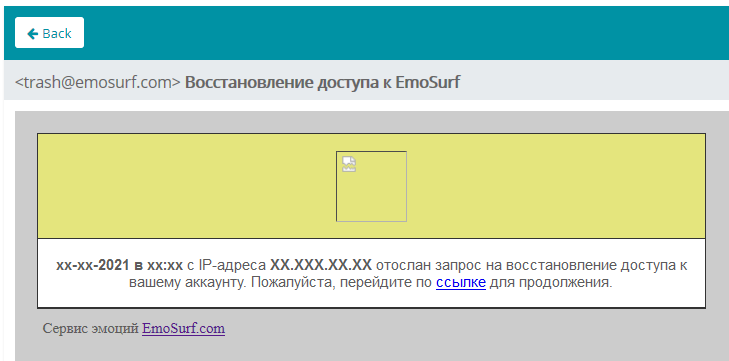
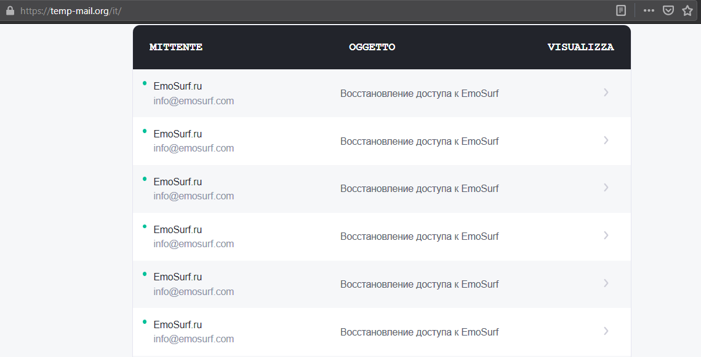

# Email Bomber

This tool allows continuous email spam without requiring registration/personal mail/enabling less secure app and other options

## How does it work?
Spam tool uses [EmoSurf.com](https://emosurf.com/) which doesn't require account activation after registration and solving captcha after multiple attempts to recover password. It makes possible to spam about 15-20 emails per second for unlimited time

## Privacy
While using this tool, emosurf.com will sending emails contain IP address. Victim will have emails starting at `DD-MM-YY в HH:MM с IP-адреса [xxx.xxx.xxx.xxx] отослан запрос`

**USE VPN IF YOU'D LIKE TO HIDE YOUR REAL IP ADDRESS**

## Spamming prevention
To avoid spamming, add **info@emosurf.com** and **trash@emosurf.com** to blacklist

## Usage
* Install [Python](https://www.python.org/), [Selenium](https://pypi.org/project/selenium/) and [Chrome Webdriver](https://chromedriver.chromium.org/downloads)
* Open script using any editing tool and enter victim's email to **victim_email** field and **threads** (4 is set by default)
* Start script using `python bomb.py`
  
  
